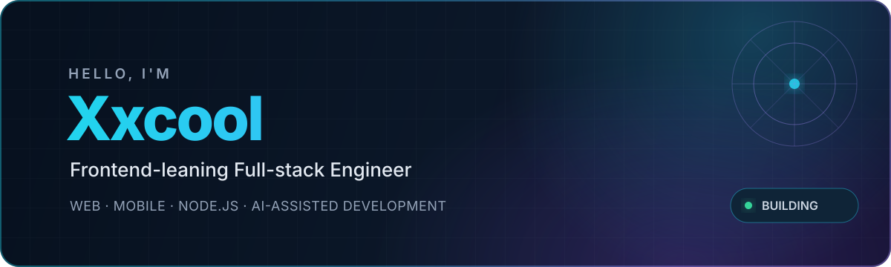
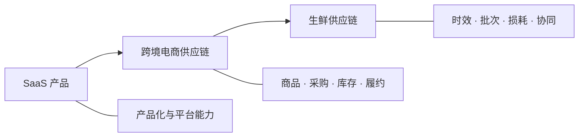

<div align="center">
  
</div>

<div align="center">
  <a href="https://github.com/Xxcool"></a>
  <a href="https://juejin.cn/user/4265760845468296/pins"></a>
  
</div>

## Hi, I'm Xxcool 👋

一名**偏前端的全栈开发者**，持续在 Web、移动端和服务端之间构建完整产品。

我关注的不只是页面实现，也关心复杂业务如何被清晰建模、稳定交付和长期维护。做过 **SaaS 产品、跨境电商供应链**，目前深耕**生鲜供应链**；日常高频使用 AI 辅助分析、编码与验证，也在持续探索可靠的 **Vibe Coding** 工作流。

```text
From polished interfaces to reliable services — I enjoy building the whole product.
```

## What I Build

<table>
  <tr>
    <td width="50%" valign="top">
      <h3>🖥️ Web Applications</h3>
      <p>以 Vue、React 和 TypeScript 构建复杂业务应用，兼顾交互体验、工程质量与可维护性。</p>
    </td>
    <td width="50%" valign="top">
      <h3>📱 Cross-platform Mobile</h3>
      <p>使用 uni-app 交付跨端移动应用，让业务能力在不同终端保持一致体验。</p>
    </td>
  </tr>
  <tr>
    <td width="50%" valign="top">
      <h3>⚙️ Full-stack Delivery</h3>
      <p>使用 Node.js、MySQL 与 Redis 打通接口、数据和缓存链路，推动产品端到端落地。</p>
    </td>
    <td width="50%" valign="top">
      <h3>🤖 AI-assisted Development</h3>
      <p>将 AI 融入需求拆解、方案设计、编码、调试与验证，在效率与工程可靠性之间保持平衡。</p>
    </td>
  </tr>
</table>

## Domain Experience



复杂业务是我技术实践的重要背景：从多角色协作和产品化能力，到商品、采购、库存与履约链路，再到生鲜场景下对时效、批次和协同的更高要求。我喜欢把这些真实约束转化为清晰、可靠的系统体验。

## Tech Landscape

| Area | Stack |
| --- | --- |
| **Frontend** |      |
| **Mobile** |  |
| **Backend** |  |
| **Data** |   |
| **Workflow** |    |

## Open-source Playground

<table>
  <tr>
    <td width="50%" valign="top">
      <h3><a href="https://github.com/Xxcool/react-music">react-music</a></h3>
      <p>使用 React 构建的网易云音乐 Web 应用实践。</p>
      <code>React</code> <code>JavaScript</code>
    </td>
    <td width="50%" valign="top">
      <h3><a href="https://github.com/Xxcool/vue3-vite-ts">vue3-vite-ts</a></h3>
      <p>基于 Vue 3、Vite 与 TypeScript 的后台应用实践。</p>
      <code>Vue 3</code> <code>Vite</code> <code>TypeScript</code>
    </td>
  </tr>
  <tr>
    <td width="50%" valign="top">
      <h3><a href="https://github.com/Xxcool/vue-sure-admin">vue-sure-admin</a></h3>
      <p>面向业务管理场景的 Vue Admin 项目。</p>
      <code>Vue</code> <code>Admin</code>
    </td>
    <td width="50%" valign="top">
      <h3><a href="https://github.com/Xxcool/Xxcool.github.io">Xxcool.github.io</a></h3>
      <p>使用 Hexo 与 GitHub Pages 搭建的个人技术博客。</p>
      <code>Hexo</code> <code>GitHub Pages</code>
    </td>
  </tr>
</table>

> 公开仓库记录了我的部分探索；更多实践来自持续演进的真实业务与产品交付。

## GitHub Activity

<div align="center">
  <picture>
    <source media="(prefers-color-scheme: dark)" srcset="https://github-readme-stats.vercel.app/api?username=Xxcool&show_icons=true&hide_border=true&bg_color=00000000&title_color=22d3ee&icon_color=22d3ee&text_color=cbd5e1" />
    
  </picture>
  <picture>
    <source media="(prefers-color-scheme: dark)" srcset="https://github-readme-stats.vercel.app/api/top-langs/?username=Xxcool&layout=compact&hide_border=true&bg_color=00000000&title_color=22d3ee&text_color=cbd5e1" />
    
  </picture>
</div>

## Currently Exploring

- 用 AI 提升从需求理解到验证交付的完整研发效率
- 更可靠、可复用的 Vibe Coding 工作流
- 复杂供应链业务中的产品体验与技术边界
- Web、移动端与服务端之间更顺畅的全栈协作

## Let's Connect

如果你也在构建复杂业务产品，或对全栈开发、供应链和 AI 编程感兴趣，欢迎交流。

<div align="center">
  <a href="https://github.com/Xxcool">GitHub</a>
  ·
  <a href="https://juejin.cn/user/4265760845468296/pins">掘金</a>
</div>

<br />

<div align="center">
  <sub>Build with clarity. Ship with confidence.</sub>
</div>
